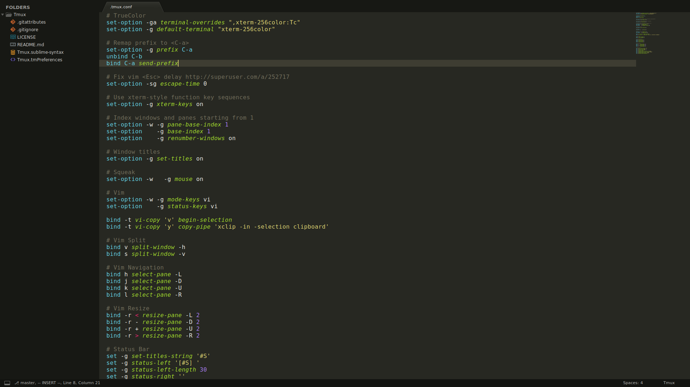

# Tmux

   

The color scheme in the screenshot is [MonokaiFree](https://github.com/gerardroche/sublime-monokai-free).

## INSTALLATION

### Manual installation

Close Sublime Text then download or clone this repository to a directory named `Tmux` in the Sublime Text Packages directory for your platform:

* Linux: `git clone https://github.com/gerardroche/sublime-tmux.git ~/.config/sublime-text-3/Packages/Tmux`
* OSX: `git clone https://github.com/gerardroche/sublime-tmux.git ~/Library/Application\ Support/Sublime\ Text\ 3/Packages/Tmux`
* Windows: `git clone https://github.com/gerardroche/sublime-tmux.git %APPDATA%\Sublime/ Text/ 3/Packages/Tmux`

## LICENSE

Released under the [BSD 3-Clause License](LICENSE).
